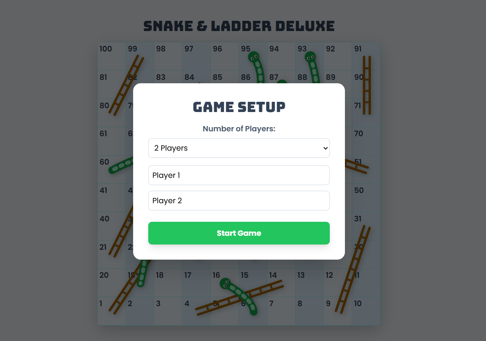
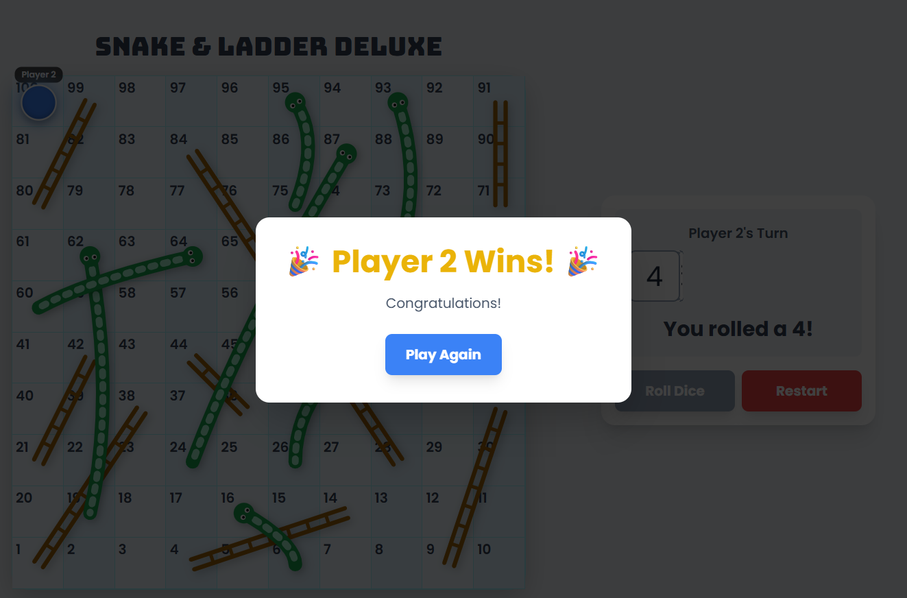

# Snake and Ladder Deluxe 🐍🪜

A modern, feature-rich web version of the classic board game, built with pure HTML, CSS, and JavaScript. It supports online multiplayer, local multiplayer, and a single-player mode against the computer.

**Live Demo:** **[https://snakeandladder234.netlify.app/](https://snakeandladder234.netlify.app/)**




*(To update the screenshot: Take a picture of your running app, name it `screenshot.png`, and place it in the main project folder.)*

-----

### 🚀 About The Project

This project was born from a love for classic board games and a passion for modern web development. The goal was to take the timeless fun of Snake and Ladder and reimagine it for the browser, creating a complete game with multiple ways to play.

This version features a dynamically generated board, interactive elements, and a 3D animated dice, all built from the ground up with fundamental web technologies and connected to a real-time database for online play.

### ✨ Features

  * **Three Game Modes**:
      * **Play Online**: Create a game room with a unique code and play with friends in real-time from different devices.
      * **Play with Computer**: Challenge a simple AI opponent in a single-player match.
      * **Play with Friends (Local)**: The classic "pass the device" mode for 2-4 players on the same screen.
  * **Fully Interactive Board**: A beautiful and clear 10x10 game board with graphical snakes and ladders.
  * **3D Animated Dice**: A realistic dice roll animation for an engaging experience.
  * **Animated Player Movement**: Tokens smoothly animate across the board, with name labels that follow them.
  * **Fully Responsive**: The layout automatically adapts for a great experience on desktop, tablet, and mobile devices.

### 🛠️ Tech Stack

This project is built using a modern frontend stack with a BaaS (Backend-as-a-Service) for online functionality:

  * **Frontend**:
      * **HTML5**: For the structure and content of the game.
      * **CSS3**: For all custom styling, animations, and the responsive layout.
      * **[Tailwind CSS](https://tailwindcss.com/)**: A utility-first CSS framework for rapid UI development.
      * **JavaScript (ES6+)**: Powers all game logic for all three modes.
  * **Backend & Real-time**:
      * **[Firebase Firestore](https://firebase.google.com/products/firestore)**: Used as a real-time database to sync game state instantly between players in the online mode.

### ⚙️ Getting Started (Local Setup)

To get a local copy up and running, follow these simple steps.

#### Prerequisites

  * A modern web browser like Google Chrome, Firefox, or Microsoft Edge.
  * [Git](https://git-scm.com/) for version control (to clone the repository).

#### Installation

1.  **Clone the repository:**

    ```bash
    git clone [https://github.com/YOUR_USERNAME/YOUR_REPOSITORY_NAME.git](https://github.com/YOUR_USERNAME/YOUR_REPOSITORY_NAME.git)
    ```

    *(Replace `YOUR_USERNAME` and `YOUR_REPOSITORY_NAME` with your actual GitHub details.)*

2.  **Navigate to the project directory:**

    ```bash
    cd YOUR_REPOSITORY_NAME
    ```

3.  **Launch the Frontend:**
    Simply open the `index.html` file in your web browser. The application will be fully functional on your local machine.

### 🤝 Contact

GitHub - @https://github.com/ashraf1808
Project Link: [https://github.com/ashraf1808/Snake_Ladder](https://github.com/YOUR_USERNAME/YOUR_REPOSITORY_NAME)