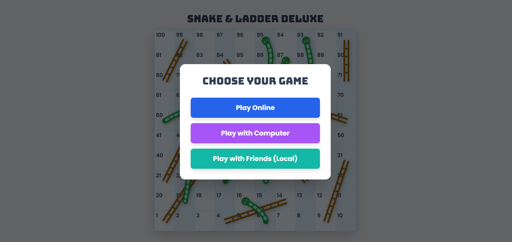
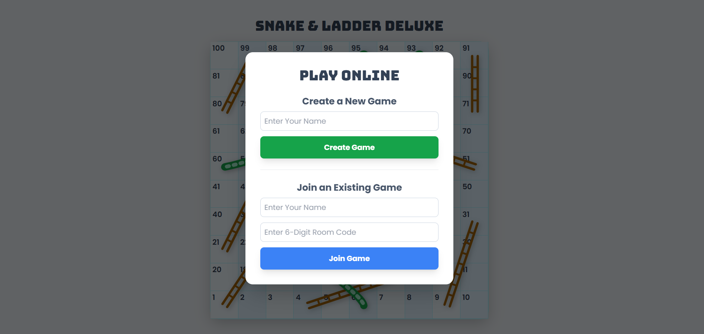

# Snake and Ladder Deluxe 🐍🪜

A modern, interactive web-based version of the classic board game, built with pure HTML, CSS, and JavaScript.

**Live Demo:** **[https://snakeandladder234.netlify.app/](https://snakeandladder234.netlify.app/)**






-----

### 🚀 About The Project

This project was born from a love for classic board games and a passion for modern web development. The goal was to take the timeless fun of Snake and Ladder and reimagine it for the browser, focusing on a clean user interface, smooth animations, and a delightful user experience.

Instead of a static image, this version features a dynamically generated board, interactive elements, and a 3D animated dice, all built from the ground up with fundamental web technologies. It's a demonstration of what can be achieved with just HTML, CSS, and JavaScript.

### ✨ Features

  * **Fully Interactive Board**: A beautiful and clear 10x10 game board.
  * **Multiplayer Support**: Play with 2 to 4 players with custom names.
  * **3D Animated Dice**: A realistic dice roll animation for an engaging experience.
  * **Animated Player Movement**: Tokens smoothly animate across the board, with name labels that follow them.
  * **Graphical Snakes & Ladders**: Custom-drawn, visually appealing snakes and ladders that are integrated directly onto the board.
  * **Fully Responsive**: The layout automatically adapts for a great experience on desktop, tablet, and mobile devices.
  * **Game Controls**: Includes a "Restart" button to quickly begin a new game at any time.

### 🛠️ Tech Stack

This project is built entirely on the frontend using core web technologies:

  * **HTML5**: For the structure and content of the game.
  * **CSS3**: For all custom styling, animations, and the responsive layout.
  * **[Tailwind CSS](https://tailwindcss.com/)**: A utility-first CSS framework used for rapid UI development and responsiveness.
  * **JavaScript (ES6+)**: Powers all the game logic, including player turns, dice rolling, movement, and DOM manipulation.

### ⚙️ Getting Started (Local Setup)

To get a local copy up and running, follow these simple steps.

#### Prerequisites

  * A modern web browser like Google Chrome, Firefox, or Microsoft Edge.
  * [Git](https://git-scm.com/) for version control (to clone the repository).

#### Installation

1.  **Clone the repository:**

    ```bash
    git clone [https://github.com/YOUR_USERNAME/YOUR_REPOSITORY_NAME.git](https://github.com/YOUR_USERNAME/YOUR_REPOSITORY_NAME.git)
    ```

    *(Replace `YOUR_USERNAME` and `YOUR_REPOSITORY_NAME` with your actual GitHub details.)*

2.  **Navigate to the project directory:**

    ```bash
    cd YOUR_REPOSITORY_NAME
    ```

3.  **Launch the Frontend:**
    Simply open the `frontend/index.html` file in your web browser. The application will be fully functional on your local machine.

### 🤝 Contact

Contact - @https://github.com/Ashrafpashamohammad

Project Link: https://github.com/Ashrafpashamohammad/Snake_Ladder